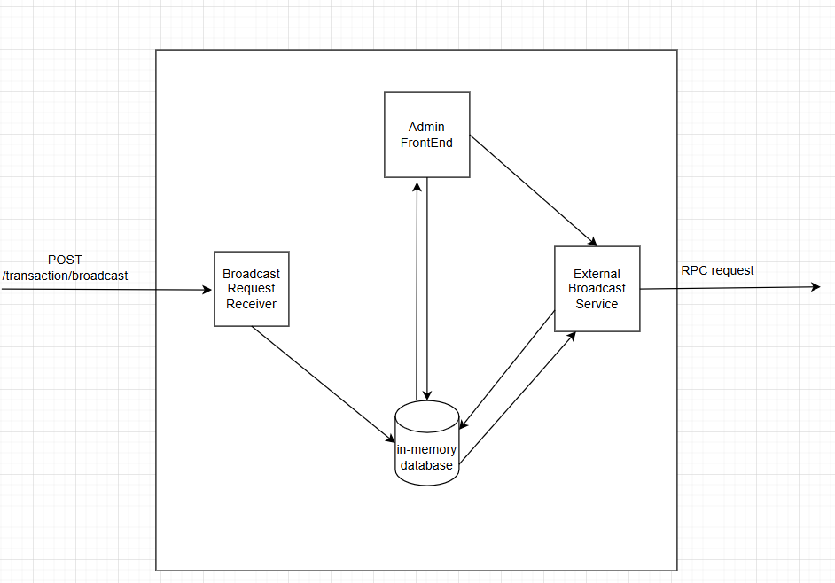

# System Design for  transaction broadcaster service

## System Flow Diagram

## System Components Breakdown

`Broadcast Request Receiver` : This component is responsible for receiving the broadcast request from other services and file the information to the database.

`In-Memory Database` : This component is responsible for storing the broadcast request information. If the expected quantity for the required amount of broadcast to store is low, a in-memory database is preferred for the increase in performance in compare to an RDBMS. However, if it is required to store requests for an extended period of time, then a traditional RDBMS would be an better option for the increase in storage space.

`External Broadcast Server`: This service serves as the main broadcasting service that would serve the RPC requests out to the blockchain mode. 

`Admin FrontEnd` : Provide a UI for admin to view and manage requests, they should be able to trigger retransmission of the request if needed.

## System Flow

1. Request is send to the Broadcast Request Receiver and file to the database, upon storage of the request into the database, an acknowledgement of HTTP 200 OK can be return to the service.
2. External Broadcast Service will poll the database for un-transmitted or failed broadcasts to (re-)send.
3. Admin FrontEnd provides an interface for the admin to view and manage the requests, they should be able to trigger retransmission of the request if needed.